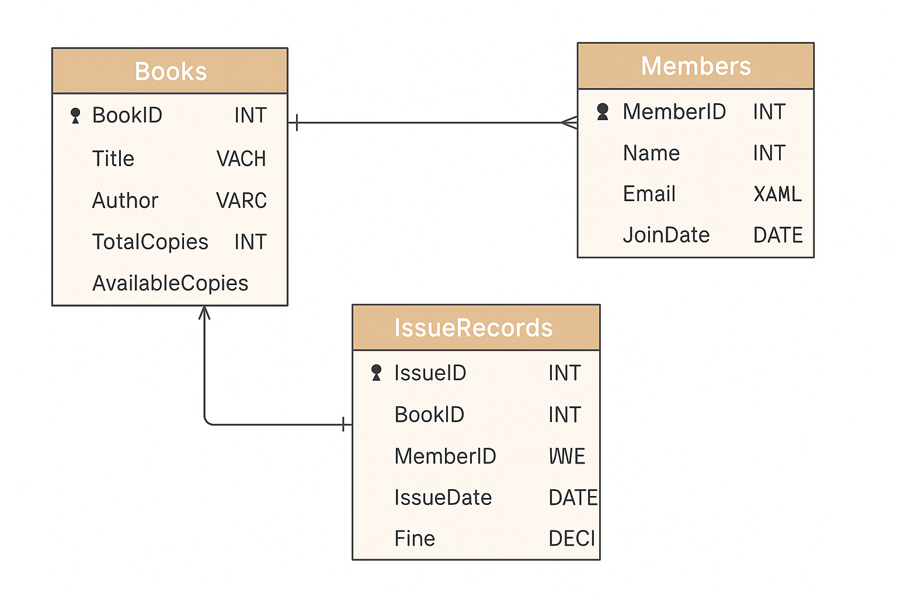

# 📚 Library Management System using MySQL

This is a real-time backend project built using **MySQL only** to manage books, members, and issue records in a library.

---

## 📌 Objective

To design and implement a Library Management System using only **MySQL**, focusing on:
- Data integrity
- Table relationships
- Real-time record tracking

---

## 🛠️ Technologies Used

- MySQL
- MySQL Workbench (for database design and ER diagram)

---

## 🗃️ Database Schema

### 📖 Books Table
| Column         | Type      | Description             |
|----------------|-----------|-------------------------|
| BookID         | INT (PK)  | Unique ID of the book   |
| Title          | VARCHAR   | Title of the book       |
| Author         | VARCHAR   | Author name             |
| TotalCopies    | INT       | Total number of copies  |
| AvailableCopies| INT       | Available copies        |

### 👤 Members Table
| Column     | Type      | Description              |
|------------|-----------|--------------------------|
| MemberID   | INT (PK)  | Unique ID of the member  |
| Name       | VARCHAR   | Full name                |
| Email      | VARCHAR   | Email address            |
| JoinDate   | DATE      | Membership start date    |

### 🔁 IssueRecords Table
| Column     | Type        | Description                              |
|------------|-------------|------------------------------------------|
| IssueID    | INT (PK)    | Unique issue record ID                   |
| BookID     | INT (FK)    | References BookID from Books             |
| MemberID   | INT (FK)    | References MemberID from Members         |
| IssueDate  | DATE        | Date book was issued                     |
| ReturnDate | DATE        | Date book was returned (nullable)        |
| Fine       | DECIMAL     | Fine amount if returned late             |

---

## 🧩 Features

- Add new books and members
- Issue books and track their status
- Return books and calculate fines
- Prevent deletion or issue if book/member doesn’t exist
- Foreign key constraints maintain data integrity

---

## 🧾 ER Diagram

---

## 📂 How to Use

1. Open MySQL Workbench
2. Run the SQL script to create tables and insert sample data
3. Use `INSERT`, `UPDATE`, `SELECT` queries to manage the system
4. Visualize schema with ERD (optional)

---

## 📃 Project Report

A detailed project report is available in `Library_Management_SQL_Project_Report.pdf`

---

## 📧 Contact

For queries, contact [bhuvanakalanjeri@gmail.com](mailto:bhuvanakalanjeri@gmail.com)

---

⭐ If you like this project, feel free to star it on GitHub!
